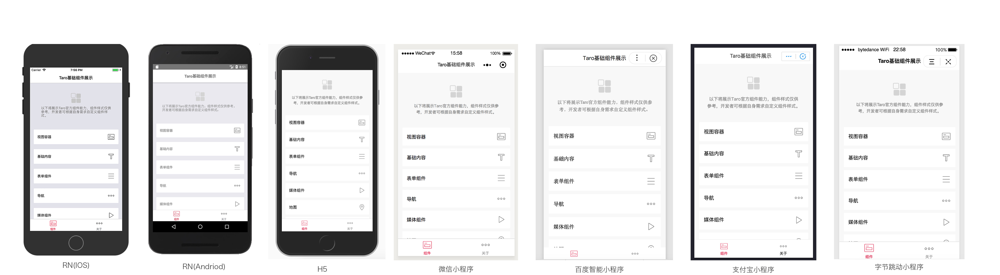
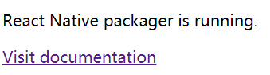

# Home

>family is the best haven

## 目录

1. Taro
   - [微信小程序转Taro](#微信小程序转Taro)
   - [安装及使用](#安装及使用)
   - [常用CLI命令](#常用CLI命令)
   - [Taro规范](https://taro-docs.jd.com/taro/docs/spec-for-taro.html)
   - [框架](https://taro-docs.jd.com/taro/docs/tutorial.html)
   - [项目配置](https://taro-docs.jd.com/taro/docs/project-config.html)
   - [最佳实践](https://taro-docs.jd.com/taro/docs/best-practice.html)
   - [路由功能](#路由功能)
   - [尺寸单位](#尺寸单位)
   - [静态资源引用](#https://taro-docs.jd.com/taro/docs/static-reference.html)
   - [组件样式](#组件样式)
   - [JSX 简介](#JSX简介)
   - [组件化 & Props](#组件化&Props)
   - [生命周期 & State](#生命周期&State)
   - [事件处理](#事件处理)
   - [条件渲染](#条件渲染)
   - [列表渲染](#列表渲染)
   - [函数式组件](#函数式组件)
   - [Context](#Context)
   - [Children与组合](#Children与组合)
   - [Render Props](#Render&nbsp;Props)
   - [Refs 引用](#Refs引用)
   - [跨平台开发](#跨平台开发)
   - [多端同步调试](#多端同步调试)
   - [小程序原生作用域获取](#小程序原生作用域获取)
   - [小程序云开发模板](#小程序云开发模板)
   - [小程序插件开发](https://taro-docs.jd.com/taro/docs/miniprogram-plugin.html)
   - [快应用端开发流程](https://taro-docs.jd.com/taro/docs/quick-app.html)
   - [React Native端开发流程](#React&nbsp;Native&nbsp;端开发流程)
   - [Taro UI](#Taro&nbsp;UI)
2. 附录
   - [经验总结](#经验总结)
3. [参考](#参考)

Taro 是一套遵循 [React](https://reactjs.org/) 语法规范的 **多端开发** 解决方案。



>🐮：一剑在手，天下我有

**Taro UI：**

一款基于 Taro 框架开发的多端 UI 组件库。Taro UI 特性：

- 基于 Taro 开发 UI 组件
- 一套组件可以在 微信小程序，支付宝小程序，百度小程序，H5 多端适配运行（ReactNative 端暂不支持）
- 提供友好的 API，可灵活的使用组件

## 微信小程序转Taro

1. 安装命令行工具：`npm i -g @tarojs/cli`
2. 在原始小程序根目录执行：`taro convert`

转换后的文件看起来就像普通的 Taro 组件，最重要的区别就在于 `@withWeapp()` 这个装饰器，你可以将它理解为转换代码的运行时，`@withWeapp()` 会增加一些原来 Taro 没有方法和属性：

- this.setData

  转换后的 this.setData 的 API 相当于小程序的 this.setData 的 polyfill，他和 this.setState 最大的区别就在于，this.setData 之后 data 的数据是同步更新，而渲染是异步更新，而 setState 两者都是异步的。

- this.data 和 this.properties

  this.data 和 this.properties 相当于 Taro 的 this.state 和 this.props 的 alias，当它们的数据更新时，对应的 state 和 props 也会同步更新。

Taro 会将原始文件的生命周期钩子函数转换为 Taro 的生命周期，完整对应关系如下：

Page.onLoad | componentWillMount
-|-
onShow | componentDidShow
onHide | componentDidHide
onReady | componentDidMount
onUnload | componentWillUnmount
onError | componentDidCatchError
App.onLaunch | componentWillMount
Component.created | componentWillMount
attached | componentDidMount
ready | componentDidMount
detached | componentWillUnmount
moved | 保留

其它常见的转换问题，请看[这里](https://taro-docs.jd.com/taro/docs/taroize.html#%E5%B8%B8%E8%A7%81%E9%97%AE%E9%A2%98)

## 安装及使用

**CLI 脚手架工具安装：**

```sh
# 使用 npm 安装 CLI
npm install -g @tarojs/cli
# OR 使用 yarn 安装 CLI
yarn global add @tarojs/cli
# OR 安装了 cnpm，使用 cnpm 安装 CLI
cnpm install -g @tarojs/cli
```

如果安装过程出现sass相关的安装错误，请在安装 [mirror-config-china](https://www.npmjs.com/package/mirror-config-china) 后重试。

```sh
npm install -g mirror-config-china
```

**初始化 Taro 项目：**

```sh
taro init mini-oa
# npm 5.2+ 也可在不全局安装的情况下使用 npx 创建模板项目
npx @tarojs/cli init myApp
```

在创建完项目之后，Taro 会默认开始安装项目所需要的依赖，安装使用的工具按照 yarn>cnpm>npm 顺序进行检测，一般来说，依赖安装会比较顺利，但某些情况下可能会安装失败，这时候你可以在项目目录下自己使用安装命令进行安装：

```sh
# 使用 yarn 安装依赖
yarn
# OR 使用 cnpm 安装依赖
cnpm install
# OR 使用 npm 安装依赖
npm install
```

Taro 需要运行不同的命令，将 Taro 代码编译成不同端的代码，然后在对应的开发工具中查看效果：

- 选择微信小程序模式
  
  需要自行下载并打开[微信开发者工具](https://developers.weixin.qq.com/miniprogram/dev/devtools/download.html)，然后在项目编译完后选择项目根目录下 dist 目录进行预览。微信小程序编译预览及打包（去掉 --watch 将不会监听文件修改，并会对代码进行压缩打包）

  ```sh
  # yarn
  yarn dev:weapp
  yarn build:weapp
  # npm script
  npm run dev:weapp
  npm run build:weapp
  # 仅限全局安装
  taro build --type weapp --watch
  taro build --type weapp
  # npx 用户也可以使用
  npx taro build --type weapp --watch
  npx taro build --type weapp
  ```

- 选择百度小程序模式
  
  需要自行下载并打开[百度开发者工具](https://smartprogram.baidu.com/docs/develop/devtools/show_sur/)，编译命令类似，只有参数不同：swan。

- 选择支付宝小程序模式
  
  需要自行下载并打开[支付宝小程序开发者工具](https://docs.alipay.com/mini/developer/getting-started/)，参数：alipay

- 选择字节跳动小程序模式
  
  需要自行下载并打开[字节跳动小程序开发者工具](https://microapp.bytedance.com/docs/devtool/versionUpdate.html)，参数：tt

- 选择 QQ 小程序模式
  
  需要自行下载并打开[QQ 小程序开发者工具](https://q.qq.com/wiki/#_4-%E7%BC%96%E7%A0%81%E5%BC%80%E5%8F%91%E5%B0%8F%E7%A8%8B%E5%BA%8F)，参数：qq

- 选择快应用模式
  
  需要自行下载并打开[快应用开发者工具](https://www.quickapp.cn/docCenter/IDEPublicity)，参数：quickapp

  快应用开发者工具如何使用？[点击了解](https://doc.quickapp.cn/tutorial/ide/overview.html)

  [快应用端开发流程](https://taro-docs.jd.com/taro/docs/quick-app.html)

- H5 模式

  无需特定的开发者工具，参数：h5

- React Native 端

  参数：rn，相关的运行说明请参见 [React Native 教程](https://taro-docs.jd.com/taro/docs/react-native.html)

  >Note：  
  >React Native 端和其他端样式兼容性差异较大，如果需要兼容 React Native 端，建议 React Native 端和其他端同步开发。  
  >如果要支持 React Native 端，必须采用 Flex 布局，并且样式选择器仅支持类选择器，且不 支持 **组合器** [Combinators and groups of selectors](https://developer.mozilla.org/en-US/docs/Learn/CSS/Introduction_to_CSS/Combinators_and_multiple_selectors)。

  以下选择器的写法都是不支持的，在样式转换时会自动忽略：

  ```css
  .button.button_theme_islands {
    font-style: bold;
  }

  img + p {
    font-style: bold;
  }

  p ~ span {
    color: red;
  }

  div > span {
    background-color: DodgerBlue;
  }

  div span {
    background-color: DodgerBlue;
  }
  ```

样式上 H5 最为灵活，小程序次之，RN 最弱，<b style="color:red">统一多端样式即是对齐短板</b>，也就是要以 RN 的约束来管理样式，同时兼顾小程序的限制，核心可以用三点来概括：

- 使用 Flex 布局
- 基于 BEM 写样式
- 采用 style 属性覆盖组件样式

RN 中 View 标签默认主轴方向是 column，如果不将其他端改成与 RN 一致，就需要在所有用到 display: flex 的地方都显式声明主轴方向。

## 常用CLI命令

```sh
# 帮助
taro --help

# 更新
# taro
taro update self
# npm
npm i -g @tarojs/cli@latest
# yarn
yarn global add @tarojs/cli@latest

# 固定版本
# 使用 npm 安装 CLI
npm install -g @tarojs/cli@1.3.9
# OR 使用 yarn 安装 CLI
yarn global add @tarojs/cli@1.3.9
# OR 安装了 cnpm，使用 cnpm 安装 CLI
cnpm install -g @tarojs/cli@1.3.9

# 更新项目中 Taro 相关的依赖
taro update project

# 环境及依赖的版本等信息
taro info

# 诊断项目的依赖、设置、结构，以及代码的规范是否存在问题，并尝试给出解决方案
taro doctor

# 在当前项目的pages目录下快速生成新的页面文件，并填充基础代码
taro create --name [页面名称]
```

自 1.3.9 开始 Taro 会在用户根目录下创建 .taro 文件夹，其中 .taro/index.json 用于存放 CLI 相关配置。开发者可以使用 taro config 命令对配置项进行一系列操作：

```sh
# 查看用法
taro config --help
# 设置配置项<key>的值为<value>
taro config set <key> <value>
# 读取配置项<key>
taro config get <key>
# 删除配置项<key>
taro config delete <key>
# 打印所有配置项
taro config list [--json]
```

## 路由功能

具体 API 说明，请查看[说明](https://taro-docs.jd.com/taro/docs/apis/interface/navigation/navigateTo.html)。

跳转：

```jsx
// 跳转到目的页面，打开新页面
Taro.navigateTo({
  url: '/pages/page/path/name'
})

// 跳转到目的页面，在当前页面打开
Taro.redirectTo({
  url: '/pages/page/path/name'
})
```

传参：

```jsx
// 传入参数 id=2&type=test
Taro.navigateTo({
  url: '/pages/page/path/name?id=2&type=test'
})
```

获取参数：

```jsx
// 在跳转成功的目标页的生命周期方法里获取传入的参数
class C extends Taro.Component {
  componentWillMount () {
    console.log(this.$router.params) // 输出 { id: 2, type: 'test' }
  }
}
```

## 尺寸单位

在 Taro 中尺寸单位建议使用 px、 百分比 %，Taro 默认会对所有单位进行转换。在 Taro 中书写尺寸按照 1:1 的关系来进行书写，即从设计稿上量的长度 100px，那么尺寸书写就是 100px，当转成微信小程序的时候，尺寸将默认转换为 100rpx，当转成 H5 时将默认转换为以 rem 为单位的值。

如果你希望部分 px 单位不被转换成 rpx 或者 rem ，最简单的做法就是在 px 单位中增加一个大写字母，例如 Px 或者 PX 这样，则会被转换插件忽略。

结合过往的开发经验，Taro 默认以 750px 作为换算尺寸标准，如果设计稿不是以 750px 为标准，则需要在项目配置 config/index.js 中进行设置，例如设计稿尺寸是 640px，则需要修改项目配置 config/index.js 中的 designWidth 配置为 640：

```jsx
const config = {
  projectName: 'myProject',
  date: '2018-4-18',
  designWidth: 640,
  ....
}
```

建议使用 Taro 时，设计稿以 iPhone 6 750px 作为设计尺寸标准。

如果你的设计稿是 375 ，不在以上三种之中，那么你需要把 designWidth 配置为 375，同时在 DEVICE_RATIO 中添加换算规则如下：

```jsx
const DEVICE_RATIO = {
  '640': 2.34 / 2,
  '750': 1,
  '828': 1.81 / 2,
  '375': 2 / 1
}
```

在编译时，Taro 会帮你对样式做尺寸转换操作，但是如果是在 JS 中书写了行内样式，那么编译时就无法做替换了，针对这种情况，Taro 提供了 API 来做运行时的尺寸转换：

```jsx
Taro.pxTransform(10) // 小程序：rpx，H5：rem
```

## 组件样式

自定义组件对应的样式文件，只对该组件内的节点生效。编写组件样式时，需要注意以下几点：

- 组件和引用组件的页面不能使用 id 选择器（#a）、属性选择器（[a]）和标签名选择器，请改用 class 选择器。
- 组件和引用组件的页面中使用后代选择器（.a .b）在一些极端情况下会有非预期的表现，如遇，请避免使用。
- 子元素选择器（.a > .b）只能用于 View 组件与其子节点之间，用于其他组件可能导致非预期的情况。
- 继承样式，如 font 、 color ，会从组件外（父组件）继承到组件内。但是引用组件时在组件节点上书写的 className 无效。
- 除继承样式外， app.scss 中的样式、组件所在页面的样式，均对自定义组件无效。

```css
#a { } /* 在组件中不能使用 */
[a] { } /* 在组件中不能使用 */
button { } /* 在组件中不能使用 */
.a > .b { } /* 除非 .a 是 view 组件节点，否则不一定会生效 */
```

除此以外，组件可以指定它所在节点的默认样式，使用 :host 选择器（需要包含基础库 1.7.2 或更高版本的开发者工具支持）：

```css
/* 该自定义组件的默认样式 */
:host {
  color: yellow;
}
```

如果想传递样式给引用的自定义组件，以下写法（直接传递 className）**不可行**：

```js
/* CustomComp.js */
export default class CustomComp extends Component {
  static defaultProps = {
    className: ''
  }

  render () {
    return <View className={this.props.className}>这段文本的颜色不会由组件外的 class 决定</View>
  }
}
```

```js
/* MyPage.js */
export default class MyPage extends Component {
  render () {
    return <CustomComp className="red-text" />
  }
}
```

```css
/* MyPage.scss */
.red-text {
  color: red;
}
```

取而代之的，需要利用 externalClasses 定义段定义若干个外部样式类。这个特性从小程序基础库版本 1.9.90 开始支持。

```js
/* CustomComp.js */
export default class CustomComp extends Component {
  static externalClasses = ['my-class']

  render () {
    return <View className="my-class">这段文本的颜色由组件外的 class 决定</View>
  }
}
```

```js
/* MyPage.js */
export default class MyPage extends Component {
  render () {
    return <CustomComp my-class="red-text" />
  }
}
```

```css
/* MyPage.scss */
.red-text {
  color: red;
}
```

>注意：externalClasses 需要使用 **短横线命名法** (kebab-case)，而不是 React 惯用的 驼峰命名法 (camelCase)。否则无效。

使用外部样式类可以让组件使用指定的组件外样式类，如果希望组件外样式类能够完全影响组件内部，可以将组件构造器中的 options.addGlobalClass 字段置为 true。这个特性从小程序基础库版本 2.2.3 开始支持。

```js
/* CustomComp.js */
export default class CustomComp extends Component {
  static options = {
    addGlobalClass: true
  }

  render () {
    return <View className="red-text">这段文本的颜色由组件外的 class 决定</View>
  }
}
```

```css
/* 组件外的样式定义 */
.red-text {
  color: red;
}
```

## JSX简介

在 Taro 中，我们使用 JSX 作为一种 DSL 进而编译成各端通用的语法。 JSX 是一种看起来很像 XML 的 JavaScript 语法扩展，比起模板语言，它具有以下优点：

- 各大编辑器和 IDE 都能提供非常良好的支持；
- 可以做到类型安全，在编译期就能发现错误；
- 提供语义化并且可以移动的标签；
- 背后的社区支持非常强力；

在 Taro 中，所有组件都应当首字母大写并且使用大驼峰式命名法（Camel-Case），否则代码可能无法按预期执行。

>和 React/Nerv 不一样的地方在于，Taro 不支持使用 点表示法 和[运行时指定类型](https://reactjs.org/docs/jsx-in-depth.html#choosing-the-type-at-runtime)来引用组件，例如 `<MyComponents.DatePicker />` 这样的写法在 Taro 中是无法正确编译的。

你可以任意地在 JSX 当中使用 JavaScript 表达式，在 JSX 当中的表达式要包含在大括号里。但是，if 语句和 for 循环在 JavaScript 中不是表达式，因此它们不能直接在 JSX 中使用，所以你可以将它们放在周围的代码中。

```jsx
import Taro, { Component } from '@tarojs/taro'

class App extends Components {
  render () {
    let description

    if (this.props.number % 2 == 0) {
      description = <Text>even</Text>
    } else {
      description = <Text>odd</Text>
    }

    return <View>{this.props.number} is an {description} number</View>
  }
}
```

你可以将字符串常量作为属性值传递。下面这两个 JSX 表达式是等价的：

```jsx
<MyComponent message="hello world" />
<MyComponent message={'hello world'} />
```

如果你没有给属性传值，它默认为 true。因此下面两个 JSX 是等价的：

```jsx
<MyTextBox autocomplete />
<MyTextBox autocomplete={true} />
```

>和 React/Nerv 的不同： React 可以使用 ... 拓展操作符来传递属性，但在 Taro 中你不能这么做。

```jsx
const props = {firstName: 'Plus', lastName: 'Second'}
return <Greeting {...props} />
// 这样的操作会报错。你只能手动地把所有需要引用的 props 写上去
<Greeting firstName="Plus" lastName="Second" />
```

如果 JSX 标签是闭合式的，那么你需要在结尾处用 />, 就好像 XML/HTML 一样。JSX 标签同样可以相互嵌套，JavaScript 表达式也可以嵌套：

```jsx
const element = <Image src={user.avatarUrl} />;

const element = (
  <View>
    <Text>Hello!</Text>
    <Text>Good to see you here.</Text>
  </View>
)

render () {
  const todos = ['finish doc', 'submit pr', 'nag dan to review'];
  return (
    <ul>
      {todos.map((todo) => <Text>{todo}</Text>)}
    </ul>
  )
}
```

false、null、undefined 和 true 都是有效的 children，但它们不会直接被渲染。下面的表达式是等价的：

```jsx
<View />
<View></View>
<View>{false}</View>
<View>{null}</View>
<View>{undefined}</View>
<View>{true}</View>
```

这在根据条件来确定是否渲染 元素时非常有用。以下的 JSX 只会在 showHeader 为 true 时渲染 `<Header />` 组件。

```jsx
<View>
  {showHeader && <Header />}
  <Content />
</View>
```

## 组件化&Props

组件可以将 UI 切分成一些的独立的、可复用的部件，这样你就只需专注于构建每一个单独的部件。

组件从概念上看就像是函数，它可以接收任意的输入值（称之为 props），并返回一个需要在页面上展示的 Taro 元素。

Taro 和 React 一样，也有一个严格的规则：所有的 Taro 组件必须像纯函数那样使用它们的 props（只读）。

随着应用日渐庞大，你可以通过类型检查捕获大量错误。要检查组件的属性，你需要配置特殊的 propTypes 属性：

```jsx
import PropTypes from 'prop-types';

class Greeting extends Component {
  render() {
    return (
      <h1>Hello, {this.props.name}</h1>
    );
  }
}

Greeting.propTypes = {
  name: PropTypes.string
};
```

如上例，Taro 与 React 一样，也支持 PropTypes 检查类型，目前在小程序端还有些问题，但在 H5 端可以使用，用法和在 React 里一样。 更多可参照 [React 的相关文档](https://reactjs.org.cn/doc/typechecking-with-proptypes.html)。

## 生命周期&State

```jsx
class Clock extends Component {
  constructor (props) {
    // 类组件应始终使用 props 调用基础构造函数
    super(props)
    this.state = { date: new Date() }
  }

  // 生命周期钩子
  componentDidMount() {
    // 挂载
    this.timerID = setInterval(
      () => this.tick(),
      1000
    )
  }

  // 在具有许多组件的应用程序中，在销毁时释放组件所占用的资源非常重要
  componentWillUnmount() {
    // 卸载
    clearInterval(this.timerID)
  }

  tick () {
    this.setState({
      date: new Date()
    });
  }

  render () {
    return (
      <View>
        <Text>Hello, world!</Text>
        <Text>现在的时间是 {this.state.date.toLocaleTimeString()}.</Text>
      </View>
    )
  }
}
```

**正确地使用 State：**

1、不要直接更新状态

```jsx
// Wrong
this.state.comment = 'Hello'
// Correct
this.setState({ comment: 'Hello' })
```

2、状态更新一定是异步的

```jsx
// Taro 可以将多个 setState() 调用合并成一个调用来提高性能。
// 因为 this.state 和 props 一定是异步更新的，所以你不能在 setState 马上拿到 state 的值
// 假设我们之前设置了 this.state.counter = 0
updateCounter () {
  this.setState({
    counter: 1
  }, () => {
    // 在这个回调函数内你可以拿到 setState 之后的值
  })
  console.log(this.state.counter) // 这里 counter 还是 0
}
```

3、state 更新会被合并

当你调用 setState()，Taro 将合并你提供的对象到当前的状态中，合并是浅合并。

## 事件处理

Taro 元素的事件处理和 DOM 元素的很相似。但是有一点语法上的不同：

- Taro 事件绑定属性的命名采用驼峰式写法，而不是小写。
- 如果采用 JSX 的语法你需要传入一个函数作为事件处理函数，而不是一个字符串 （DOM 元素的写法）。
- 在 Taro 中另一个不同是你不能使用 catchEvent 的方式阻止事件冒泡。你必须明确的使用 stopPropagation。

传统的微信小程序模板：

```html
<button onclick="activateLasers">
  Activate Lasers
</button>
```

Taro 中稍稍有点不同：

```jsx
<button onClick={this.activateLasers}>
  Activate Lasers
</button>
```

阻止事件冒泡你可以这样写：

```jsx
class Toggle extends Component {
  constructor (props) {
    super(props)
    this.state = {isToggleOn: true}
  }

  onClick = (e) => {
    e.stopPropagation()
    this.setState(prevState => ({
      isToggleOn: !prevState.isToggleOn
    }))
  }

  render () {
    return (
      <button onClick={this.onClick}>
        {this.state.isToggleOn ? 'ON' : 'OFF'}
      </button>
    )
  }
}
```

通常我们会为事件处理程序传递额外的参数。例如，传入欲删除行的 id：

```jsx
<button onClick={this.deleteRow.bind(this, id)}>Delete Row</button>
```

当你通过 bind 方式向监听函数传参，在类组件中定义的监听函数，事件对象 e 要排在所传递参数的后面。

自 v1.2.9 开始支持匿名函数。

```jsx
class Popper extends Component {
  constructor () {
    super(...arguments)
    this.state = { name: 'Hello world!' }
  }

  render () {
    const name = 'test'
    return (
      <Button onClick={(e) => {
        e.stopPropagation()
        this.setState({
          name
        })
      }}>
        {this.state.name}
      </Button>
    )
  }
}
```

>注意：使用通过 usingComponents 的第三方组件不支持匿名函数

除了 bind 和匿名函数之外，事件参数也可以使用柯里化传参。

```jsx
class Title extends Component{

  handleClick = (index) => (e) => {
    e.stopPropagation()
    this.setState({
      currentIndex: index
    })
  }

  render() {
    const { currentIndex } = this.props;
    return (
      {/* 调用 `this.handleClick(currentIndex)` 会返回一个函数，这个函数可以访问到 `currentIndex` 同时也能满足 `onClick` 的签名 */}
      <View onClick={this.handleClick(currentIndex)}>
      </View>
    )
  }
 }
```

在函数式组件中，事件传参可以传入事件的引用也可以传入匿名函数，以下是函数式组件配合 [useCallback](https://taro-docs.jd.com/taro/docs/hooks.html#usecallback) 的一个例子：

```jsx
const App = () => {
  const [c1, setC1] = useState(0);
  const [c2, setC2] = useState(0);
  const [c3, setC3] = useState(0);

  const increment = c => c + 1

  // 只有 useCallback 对应的 c1 或 c2 的值改变时，才会返回新的函数
  const increment1 = useCallback(() => setC1(increment), [c1]);
  const increment2 = useCallback(() => setC2(increment), [c2]);

  return (<View>
    <Text> Counter 1 is {c1} </Text>
    <Text> Counter 2 is {c2} </Text>
    <Text> Counter 3 is {c3} </Text>
    <View>
      <Button onClick={increment1}>Increment Counter 1</Button>
      <Button onClick={increment2}>Increment Counter 2</Button>
      <Button onClick={() => setC3(increment)}>Increment Counter 3</Button>
    </View>
  </View>)
}
```

任何组件的事件传递都要以 on 开头

## 条件渲染

在 Taro 中，你可以创建不同的组件来封装各种你需要的行为。然后还可以根据应用的状态变化只渲染其中的一部分。

Taro 中的条件渲染和 JavaScript 中的一致，使用 Taro 操作符 if 或条件运算符来创建表示当前状态的元素，然后让 Taro 根据它们来更新 UI。

**1、元素变量：**

```jsx
// LoginStatus.js
class LoginStatus extends Component {
  render () {
    const isLoggedIn = this.props.isLoggedIn
    // 这里最好初始化声明为 `null`，初始化又不赋值的话
    // 小程序可能会报警为变量为 undefined
    let status = null
    if (isLoggedIn) {
      status = <Text>已登录</Text>
    } else {
      status = <Text>未登录</Text>
    }

    return (
      <View>
        {status}
      </View>
    )
  }
}
// app.js
import LoginStatus from './LoginStatus'

// 这样会渲染 `已登录`
class App extends Component {
  render () {
    return (
      <View>
        <LoginStatus isLoggedIn={true} />
      </View>
    )
  }
}
```

**2、&&：**

```jsx
class LoginStatus extends Component {
  render () {
    const isLoggedIn = this.props.isLoggedIn

    return (
      <View>
        {isLoggedIn && <Text>已登录</Text>}
        {!isLoggedIn && <Text>未登录</Text>}
      </View>
    )
  }
}
```

**3、三元运算符（条件表达式）：**

```jsx
class LoginStatus extends Component {
  render () {
    const isLoggedIn = this.props.isLoggedIn

    return (
      <View>
      {isLoggedIn
        ? <Text>已登录</Text>
        : <Text>未登录</Text>
      }
      </View>
    )
  }
}
```

**4、枚举条件渲染：**

```jsx
function Loading (props) {
  const { loadingText, LOADING_STATUS, loadingStatus, onRetry } = props
  return (
    <View className='loading-status'>
      {
        {
          'loading': loadingText,
          'fail': <View onClick={onRetry}> 加载失败, 点击重试 </View>,
          'no-more': '没有更多了'
        }[loadingStatus] /** loadingStatus 是 `loading`、`fail`、`no-more`  其中一种状态 **/
      }
    </View>
  )
}
```

## 列表渲染

渲染多个组件：

```jsx
const numbers = [...Array(100).keys()] // [0, 1, 2, ..., 98, 99]
const listItems = numbers.map((number) => {
  return <Text
    key={String(number)}
    className='li'
    >
    我是第 {number + 1} 个数字
  </Text>
})
```

Keys 可以在 DOM 中的某些元素被增加或删除的时候帮助 Nerv/小程序 识别哪些元素发生了变化。

数组元素中使用的 key 在其兄弟之间应该是独一无二的。然而，它们不需要是全局唯一的。当我们生成两个不同的数组时，我们可以使用相同的 key。

key 的取值必须同时满足三个条件：

- 稳定
- 可预测
- 唯一（相对于其他兄弟元素）

taroKey 适用于循环渲染原生小程序组件，赋予每个元素唯一确定标识，转换为小程序的 wx:key。

## 函数式组件

**1、普通函数式组件：**

```jsx
// 函数式组件
function Welcome(props) {
  return <View>Hello, {props.name}</View>;
}

// 相对于的 ES6 Class 组件是
class Welcome extends React.Component {
  render() {
    return <View>Hello, {this.props.name}</View>;
  }
}
```

在 Taro 中使用函数式组件有以下限制：

1. 函数的命名需要遵循[帕斯卡式命名法](https://baike.baidu.com/item/%E5%B8%95%E6%96%AF%E5%8D%A1%E5%91%BD%E5%90%8D%E6%B3%95/9464494?fr=aladdin)；
2. 一个文件中只能定义一个普通函数式组件或一个 Class 组件

**2、类函数式组件：**

由于一个文件不能定义两个组件，但有时候我们需要组件内部的抽象组件，这时类函数式组件就是你想要答案。假设我们有一个 Class 组件，它包括了一个 Header 一个 Footer，我们可以这样定义：

```jsx
class SomePage extends Taro.Component {
  renderHeader () {
    const { header } = this.state
    return <View>{header}</View>
  }

  renderFooter (footer) {
    return <View>{footer}</View>
  }

  render () {
    return (
      <View>
        {this.renderHeader()}
        {...}
        {this.renderFooter('footer')}
      </View>
    )
  }
}
```

在 renderHeader 或 renderFooter 函数中，我们可以访问类的 this，也可以传入不限量的参数，这类型的函数也可以调用无限次数。但这样的写法也存在一些限制：

1. 函数的命名必须以 render 开头，render 后的第一个字母需要大写
2. 函数的参数不得传入 JSX 元素或 JSX 元素引用
3. 函数不能递归地调用自身

>形如 renderHeader 这样的函数在小程序中会编译成 template，而小程序的 template 是无法做到递归调用自身的。当你有这样的需求时，可以新建两个一模一样的组件和文件：ComponentA 和 ComponentB，在 ComponentA 中调用 ComponentB，在 ComponentB 中调用 ComponnetA。

**3、闭包函数式组件：**

在一个普通的函数式组件中，我们需要一个另外的抽象组件多次调用，同时我们还希望这个抽象组件能访问到我们当前作用域的值，这时候我们就需要闭包函数式组件：

```jsx
function Header ({ user }) {
  const name = user.name
  const renderTitle = () => {
    // renderTitle 每次都能获取到当前作用域 `name` 的值
    return <View>Welcome, {name}</View>
  }
  return (
    <View>
      {/* 重要人士我们要欢迎他三次 */ }
      {renderTitle()}
      {renderTitle()}
      {renderTitle()}
    </View>
  )
}
```

闭包函数式组件遵循所有类函数式的限制，包括命名，传参，调用，并且它只能在一个普通函数式组件或类函数式组件以及 Taro.Component 的 render 函数中定义及调用。

## Context

在一个典型的 Taro 应用中，数据是通过 props 属性自上而下（由父及子）进行传递的，但这种做法对于某些类型的属性而言是极其繁琐的（例如：地区偏好，UI 主题），这些属性是应用程序中许多组件都需要的。Context 提供了一种在组件之间共享此类值的方式，而不必显式地通过组件树的逐层传递 props。

```jsx
// counter-context.js
export const CounterContext = Taro.createContext(0);

// index.js
class Index extends Component {
  render () {
    const [ count, setCount ] = useState(0)
    return (
      <CounterContext.Provider value={count}>
        <View className='container'>
          <Test />
          <Button onClick={() => setCount(0)}>Reset</Button>
          <Button onClick={() => setCount(prevCount => prevCount + 1)}>+</Button>
          <Button onClick={() => setCount(prevCount => prevCount - 1)}>-</Button>
        </View>
      </CounterContext.Provider>
    )
  }
}

// child.js
class Child extends Taro.Component {
  shouldComponentUpdate () {
    // 即便返回 false 也不会阻止 CounterContext 更新消费它的组件
    return false
  }

  render () {
    return <Counter />
  }
}

// counter.js
import { CounterContext } from './counter-context.js'
class Counter extends Taro.Component {
  static contextType = CounterContext

  render () {
    const value = this.context
    return (
      <View>
        Count: {value}
      </View>
    )
  }
}
```

我们在这个例子中把计数器 count 的值通过 CounterContext.Provider 往下传递，Child 组件中虽然禁止了更新，但 Counter 组件在 CounterContext.Provider 的 value 每次变化之后，还是能够订阅更新，收到每次 count 的值。

消费多个 Context：

```jsx
const ThemeContext = Taro.createContext('light');

// 用户登录 context
const UserContext = Taro.createContext({
  name: 'Guest',
});

class App extends Taro.Component {
  render() {
    const {signedInUser, theme} = this.props;

    // 提供初始 context 值的 App 组件
    return (
      <ThemeContext.Provider value={theme}>
        <UserContext.Provider value={signedInUser}>
          <Layout />
        </UserContext.Provider>
      </ThemeContext.Provider>
    );
  }
}

function Layout() {
  return (
    <div>
      <Sidebar />
      <Content />
    </div>
  );
}

// 一个组件可能会消费多个 context
function Content() {
  const theme = useContext(ThemeContext)
  const user =  useContext(UserContext)
  return (
    <ProfilePage user={user} theme={theme} />
  )
}
```

## Children与组合

>经测试，由于微信小程序的 `<slot />` 无法在循环中使用，因此 Children 和组合在微信小程序中也无法在循环中使用。百度小程序、支付宝小程序、H5、React Native 都可以在循环中使用此功能。

在我们设计组件时，有些组件通常不知道自己的子组件会有什么内容，例如 Sidebar 和 Dialog 这样的容器组件。

我们建议在这样的情况使用 this.props.children 来传递子元素

```jsx
class Dialog extends Component {
  render () {
    return (
      <View className='dialog'>
        <View className='header'>Welcome!</View>
        <View className='body'>
          {this.props.children}
        </View>
        <View className='footer'>-- divider --</View>
      </View>
    )
  }
}
```

这样就能允许其它组件在 JSX 中嵌套任意子组件传递给 Dialog:

```jsx
class App extends Component {
  render () {
    return (
      <View className='container'>
        <Dialog>
          <View className="dialog-message">
            Thank you for using Taro.
          </View>
        </Dialog>
      </View>
    )
  }
}
```

注意事项：

1. 请不要对 this.props.children 进行任何操作。
2. this.props.children 无法用 defaultProps 设置默认内容。
3. 不能把 this.props.children 分解为变量再使用。

有些情况你不仅仅需要只传递一个子组件，可能会需要很多个「占位符」。例如在这个 Dialog 组件中，你不仅需要自定义它的 body，你希望它的 header 和 footer 都是给 Dialog 组件的使用者自由定制。这种情况可以这样做：

```jsx
class Dialog extends Component {
  render () {
    return (
      <View className='dialog'>
        <View className='header'>
          {this.props.renderHeader}
        </View>
        <View className='body'>
          {this.props.children}
        </View>
        <View className='footer'>
          {this.props.renderFooter}
        </View>
      </View>
    )
  }
}

class App extends Component {
  render () {
    return (
      <View className='container'>
        <Dialog
          renderHeader={
            <View className='welcome-message'>Welcome!</View>
          }
          renderFooter={
            <Button className='close'>Close</Button>
          }
        >
          <View className="dialog-message">
            Thank you for using Taro.
          </View>
        </Dialog>
      </View>
    )
  }
}
```

注意事项：

1. 组件的组合需要遵守 this.props.children 的所有规则
2. 所有组合都必须用 render 开头，且遵守驼峰式命名法
3. 组合只能传入单个 JSX 元素，不能传入其它任何类型

## Render&nbsp;Props

render props 是指一种在 Taro 组件之间使用一个值为函数的 prop 共享代码的简单技术。

具有 render prop 的组件接受一个函数，该函数返回一个 Taro 元素并调用它而不是实现自己的渲染逻辑。

举个例子，假设我们有一个组件，它可以呈现一张在屏幕上追逐鼠标的猫的图片。我们或许会使用 `<Cat mouse={{ x, y }}` prop 来告诉组件鼠标的坐标以让它知道图片应该在屏幕哪个位置。

我们可以提供一个带有函数 prop 的 `<Mouse>` 组件，它能够动态决定什么需要渲染的，而不是将 `<Cat>` 硬编码到 `<Mouse>` 组件里，并有效地改变它的渲染结果。

```jsx
// cat.js
import catImage from './cat.jpg'
class Cat extends Taro.Component {
  static defaultProps = {
    mouse: {
      x: 0,
      y: 0
    }
  }

  render() {
    const { mouse } = this.props;
    return (
      <Image src={catImage} style={{ position: 'absolute', left: mouse.x, top: mouse.y }} />
    );
  }
}

// mouse.js
class Mouse extends Taro.Component {
  constructor(props) {
    super(props);
    this.handleMouseMove = this.handleClick.bind(this);
    this.state = { x: 0, y: 0 };
  }

  handleClick(event) {
    const { x, y }  = event.detail
    this.setState({
      x,
      y
    });
  }

  render() {
    return (
      <View style={{ height: '100%' }} onClick={this.handleClick}>

        {/*
          我们可以把 prop 当成一个函数，动态地调整渲染内容。
        */}
        {this.props.renderCat(this.state)}
      </View>
    );
  }
}

// MouseTracker.js
class MouseTracker extends Taro.Component {
  render() {
    return (
      <View>
        <View>点击鼠标!</View>
        {/*
          Mouse 如何渲染由 MouseTracker 的状态控制
        */}
        <Mouse renderCat={mouse => (
          <Cat mouse={mouse} />
        )}/>
      </View>
    );
  }
}
```

现在，我们提供了一个 render 方法 让 `<Mouse>` 能够动态决定什么需要渲染，而不是克隆 `<Mouse>` 组件然后硬编码来解决特定的用例。

更具体地说，render prop 是 **一个用于告知组件需要渲染什么内容的函数** prop。

这项技术使我们共享行为非常容易。要获得这个行为，只要渲染一个带有 render prop 的 `<Mouse>` 组件就能够告诉它当前鼠标坐标 (x, y) 要渲染什么。

## Refs引用

>Refs 提供了一种访问在 render 方法中创建的 DOM 节点（小程序原生组件）或 Taro 组件实例的方式。

不要过度使用 Refs！

**1、使用字符串创建 ref：**

```jsx
class MyComponent extends Component {

  componentDidMount () {
    // 如果 ref 的是小程序原生组件，那只有在 didMount 生命周期之后才能通过
    // this.refs.input 访问到小程序原生组件
    if (process.env.TARO_ENV === 'weapp') {
      // 这里 this.refs.input 访问的时候通过 `wx.createSeletorQuery` 取到的小程序原生组件
    } else if (process.env.TARO_ENV === 'h5') {
      // 这里 this.refs.input 访问到的是 `@tarojs/components` 的 `Input` 组件实例
    }
  }

  render () {
    return <Input ref='input' />
  }
}
```

**2、通过函数创建 ref：**

```jsx
/**
 * 通过传递一个函数创建 ref, 在函数中被引用的组件会作为函数的第一个参数传递。
 * 如果是被引用的组件是自定义组件，那可以在任意的生命周期访问引用。
 * 推荐方式
 */
class MyComponent extends Component {

  roar () {
    // 会打印 `miao, miao, miao~`
    this.cat.miao()
  }

  refCat = (node) => this.cat = node // `this.cat` 会变成 `Cat` 组件实例的引用

  render () {
    return <Cat ref={this.refCat} />
  }
}

class Cat extends Component {
  miao () {
    console.log('miao, miao, miao~')
  }

  render () {
    return <View />
  }
}
```

**3、通过 createRef 创建 ref：**

```jsx
class MyComponent extends Component {

  this.cat = Taro.createRef()

  roar () {
    // 对该节点的引用可以在 ref 的 current 属性中被访问
    // 会打印 `miao, miao, miao~`
    this.cat.current.miao()
  }

  render () {
    return <Cat ref={this.cat} />
  }
}

class Cat extends Component {
  miao () {
    console.log('miao, miao, miao~')
  }

  render () {
    return <View />
  }
}
```

## 跨平台开发

Taro 的设计初衷就是为了统一跨平台的开发方式，并且已经尽力通过运行时框架、组件、API 去抹平多端差异，但是由于不同的平台之间还是存在一些无法消除的差异，所以为了更好的实现跨平台开发，Taro 中提供了如下的解决方案：

**1、内置环境变量：**

- process.env.TARO_ENV：weapp / swan / alipay / h5 / rn / tt / qq / quickapp
- [参考](https://taro-docs.jd.com/taro/docs/best-practice.html#%E6%9C%80%E4%BD%B3%E7%BC%96%E7%A0%81%E6%96%B9%E5%BC%8F)

**2、统一接口的多端文件：**

开发者可以通过使用统一接口的多端文件，来解决跨端差异的功能：

- 将文件修改成 `原文件名 + 端类型` 的命名形式
- 不同端的文件代码对外保持统一接口
- 引用的时候仍然是 import 原文件名的文件
- 端类型对应着 process.env.TARO_ENV 的值

## 多端同步调试

在 dist 目录下创建一个与编译的目标平台名同名的目录，各个平台互不影响，从而达到多端同步调试的目的。

在 config/index.js 配置如下：

```js
outputRoot: `dist/${process.env.TARO_ENV}`
```

## 小程序原生作用域获取

在 Taro 的页面和组件类中，this 指向的是 Taro 页面或组件的实例，但是一般我们需要获取 Taro 的页面和组件所对应的小程序原生页面和组件的实例，这个时候我们可以通过 this.$scope 就能访问到它们。

## 小程序云开发模板

在 1.2.20 版本中，新增了小程序云开发项目模板。如需使用，请将 CLI 更新至 1.2.20 以上版本。[更新](https://taro-docs.jd.com/taro/docs/GETTING-STARTED.html#%E6%9B%B4%E6%96%B0)

模板目录结构：

```txt
├── client                                  小程序端目录
│   ├── config                              配置目录
│   │   ├── dev.js                          开发时配置
│   │   ├── index.js                        默认配置
│   │   └── prod.js                         打包时配置
│   ├── dist                                编译结果目录
│   ├── package.json
│   ├── src                                 源码目录
│   │   ├── app.scss                        项目总通用样式
│   │   ├── app.js                          项目入口文件
│   │   ├── components                      组件文件目录
│   │   │   └── login                       login 组件目录
│   │   │       └── index.weapp.js          login 组件逻辑
│   │   └── pages                           页面文件目录
│   │       └── index                       index 页面目录
│   │           ├── index.scss              index 页面逻辑
│   │           └── index.js                index 页面样式
├── cloud                                   服务端目录
│   └── functions                           云函数目录
│       └── login                           login 云函数
│           ├── index.js                    login 函数逻辑
│           └── package.json
└── project.config.json                     小程序项目配置
```

使用要点：

1. 开发时，进入 client 目录，在此目录下运行相关编译预览或打包命令
2. 使用微信开发者工具调试项目，请将项目 **整个文件夹** 作为运行目录。 注意： 不是 client 中生成的 dist 文件夹

## React&nbsp;Native&nbsp;端开发流程

Taro 移动端的开发基于 Facebook 的开源项目 [React Native](https://github.com/facebook/react-native)，目前是项目依赖中固定 React Native 版本为 0.55.4。整个 RN 端的架构如下：


### 搭建 Android 环境

必须安装的依赖有：Node、Watchman 和 React Native 命令行工具以及 JDK 和 Android Studio。

1. 安装 [Android Studio](https://developer.android.com/studio/index.html)
2. 安装 Android SDK
3. 配置 ANDROID_HOME 环境变量
4. 准备 Android 设备

RN 编译预览模式：

```sh
# yarn
yarn dev:rn
# npm script
npm run dev:rn
# 仅限全局安装
taro build --type rn --watch
# npx 用户也可以使用
npx taro build --type rn --watch
```

编译后的代码及应用文件在根目录的 rn_temp 目录下，常见的工程目录结构如下：

```txt
rn_temp
├── app.js
├── app.json
├── app_styles.js
├── index.html
├── index.js
├── package-lock.json
├── package.json
├── pages
│   └── index
│       ├── component.js
│       ├── index.js
│       └── index_styles.js
├── bundle
│   ├── assets
│   ├── index.bundle
│   └── index.bundle.meta
└── yarn.lock
```

其中关键文件及目录如下：

- app.json React Native 应用的配置，从 config.rn.appJson 中获取
- bundle: 实时编译的 jsbundle 临时文件

如果编译没有报错，会自动打开一个终端，并在 8081 端口启动 Metro Bundler 负责打包 jsbundle：

>注意：少数电脑上，可能不会 自动打开一个终端，这时你可以在项目根目录下运行：`react-native start` 手动启动。

这时，在浏览器输入 [http://127.0.0.1:8081](http://127.0.0.1:8081)，可以看到如下页面：



输入 [http://127.0.0.1:8081/rn_temp/index.bundle?platform=android&dev=true](http://127.0.0.1:8081/rn_temp/index.bundle?platform=android&dev=true) 会触发对应终端平台的 js bundle 构建，构建完成后，浏览器会显示构建后的 js 代码。

>Note：进入下一步之前请确保 Metro Bundler Server 正常启动，即浏览器能正常访问访问 jsbundle。

如果上一步的编译和 Metro Bundler Server 启动没问题，接下来就可以启动应用了。

开发者可以自行[整合 React Native (0.55.4) 到原生应用](https://reactnative.cn/docs/0.55/integration-with-existing-apps/)，同时为了方便大家开发和整合，Taro 将 React Native 工程中原生的部分剥离出来，单独放在一个工程里面 [NervJS/taro-native-shell](https://github.com/NervJS/taro-native-shell)，你可以把它看成是 React Native iOS/Android 空应用的壳子。

首先将应用代码 clone 下来：

```sh
git clone https://github.com/NervJS/taro-native-shell.git
```

然后 cd taro-native-shell，使用 yarn 或者 npm install 安装依赖。

在 taro-native-shell/android 目录下，你就可以看到 React Native 的工程代码。

在 package.json 文件中添加运行脚本（默认使用 node_modules 目录中的命令，否则就使用全局命令）：

```json
"scripts": {
  "android": "react-native run-android",
  "ios": "react-native run-ios",
  // 其它脚本...
}
```

```sh
# 运行
npm run android
```

Android 模拟器会自行启动，并访问 8081 端口获取 js bundle。

更多资料可以查看 [React Native 调试](https://reactnative.cn/docs/debugging.html)。

## Taro&nbsp;UI

安装：

```sh
npm install taro-ui --save
```

构建并运行微信小程序：

```sh
npm run dev:weapp
npm run build:weapp
# 仅限全局安装
taro build --type weapp --watch
# 去掉 --watch 将不会监听文件修改，并会对代码进行压缩打包
taro build --type weapp
```

## 云开发 quickstart

这是云开发的快速启动指引，其中演示了如何上手使用云开发的三大基础能力：

- 数据库：一个既可在小程序前端操作，也能在云函数中读写的 JSON 文档型数据库
- 文件存储：在小程序前端直接上传/下载云端文件，在云开发控制台可视化管理
- 云函数：在云端运行的代码，微信私有协议天然鉴权，开发者只需编写业务逻辑代码

## 经验总结

- 在包的根目录里运行命令：`npm install` ，默认会安装两种依赖。使用 `npm install --production` 则只安装 dependencies 而不安装 devDependencies。

## 参考

- [Taro 官方网站](https://taro.aotu.io/)
- [Taro-UI 官方网站](https://taro-ui.aotu.io/)
- [taro-sample-weapp](https://github.com/NervJS/taro-sample-weapp)
- [云开发文档](https://developers.weixin.qq.com/miniprogram/dev/wxcloud/basis/getting-started.html)
- [taro-kit](https://github.com/wsdo/taro-kit)
- [taro-sample-weapp](https://github.com/NervJS/taro-sample-weapp)
- 社区共享
  - [Taro 交流社区——让每一次交流都被沉淀](https://taro-club.jd.com/) 如果您在此文档没有找到想要的答案，请移步社区提问，我们会在看到的第一时间给予答复。
  - [Taro 物料市场——让每一个轮子产生价值](https://taro-ext.jd.com/) 如果您想找一些现成的物料，例如：模版、组件、SDK、UI，可以移步物料市场查找，也欢迎您发布物料与其他开发者共享。
- [更多资源](https://taro-docs.jd.com/taro/docs/composition.html)
- [小程序多端框架全面评测](https://juejin.im/post/5c90eb366fb9a070d4199cc9?utm_source=tuicool&utm_medium=referral)
